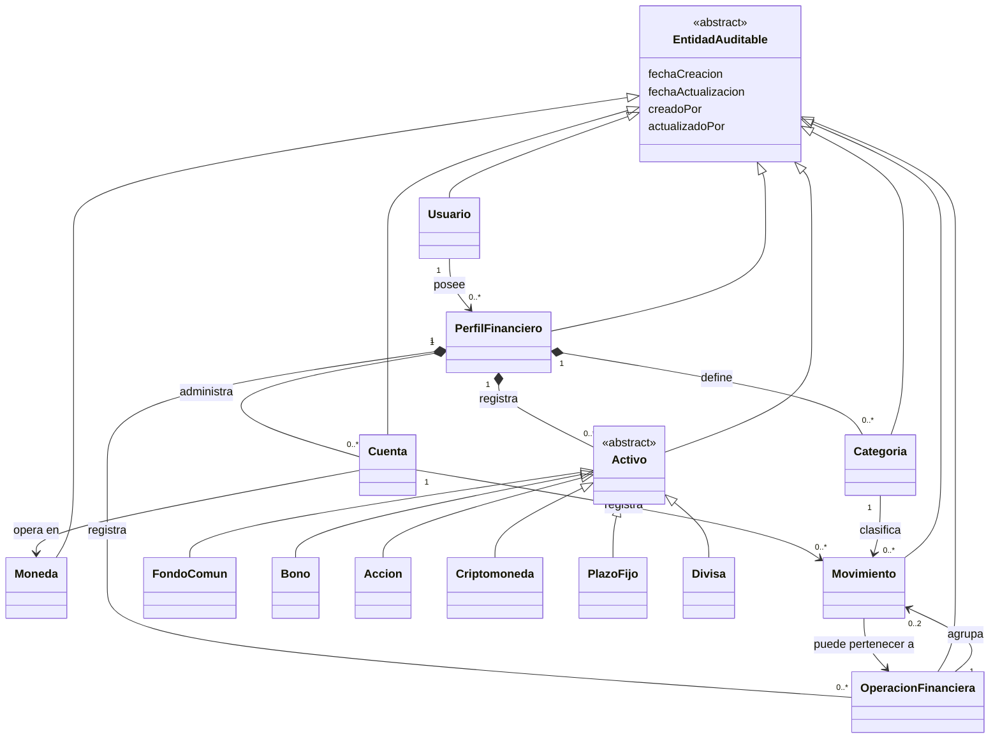

# Diagrama de dominio

El siguiente diagrama representa el modelo implementado actualmente. Las entidades futuras de movimientos específicos de activos no se muestran como parte del modelo actual.

## Evolución futura

Cuando se incorporen posiciones de activos, podrá definirse un modelo específico para los movimientos que afecten dichas posiciones. Esa evolución deberá documentarse y validarse antes de considerarla parte del dominio implementado.
