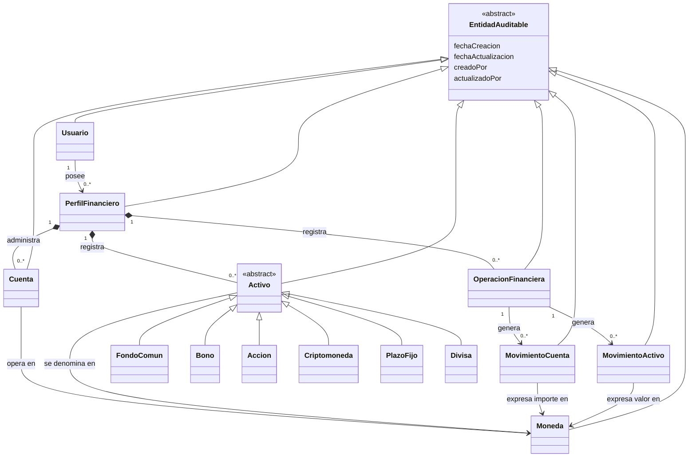

# Diagrama de dominio

```mermaid
classDiagram
    class EntidadAuditable {
        <<abstract>>
        fechaCreacion
        fechaActualizacion
        creadoPor
        actualizadoPor
    }

    class Usuario
    class PerfilFinanciero
    class Cuenta
    class Moneda
    class OperacionFinanciera
    class MovimientoCuenta
    class MovimientoActivo

    class Activo {
        <<abstract>>
    }
    class FondoComun
    class Bono
    class Accion
    class Criptomoneda
    class PlazoFijo
    class Divisa

    Usuario "1" --> "0..*" PerfilFinanciero : posee
    PerfilFinanciero "1" *-- "0..*" Cuenta : administra
    PerfilFinanciero "1" *-- "0..*" Activo : registra
    PerfilFinanciero "1" *-- "0..*" OperacionFinanciera : registra

    Activo <|-- FondoComun
    Activo <|-- Bono
    Activo <|-- Accion
    Activo <|-- Criptomoneda
    Activo <|-- PlazoFijo
    Activo <|-- Divisa

    OperacionFinanciera "1" --> "0..*" MovimientoCuenta : genera
    OperacionFinanciera "1" --> "0..*" MovimientoActivo : genera

    Cuenta --> Moneda : opera en
    Activo --> Moneda : se denomina en
    MovimientoCuenta --> Moneda : expresa importe en
    MovimientoActivo --> Moneda : expresa valor en

    EntidadAuditable <|-- Usuario
    EntidadAuditable <|-- PerfilFinanciero
    EntidadAuditable <|-- Cuenta
    EntidadAuditable <|-- Moneda
    EntidadAuditable <|-- Activo
    EntidadAuditable <|-- OperacionFinanciera
    EntidadAuditable <|-- MovimientoCuenta
    EntidadAuditable <|-- MovimientoActivo
```
